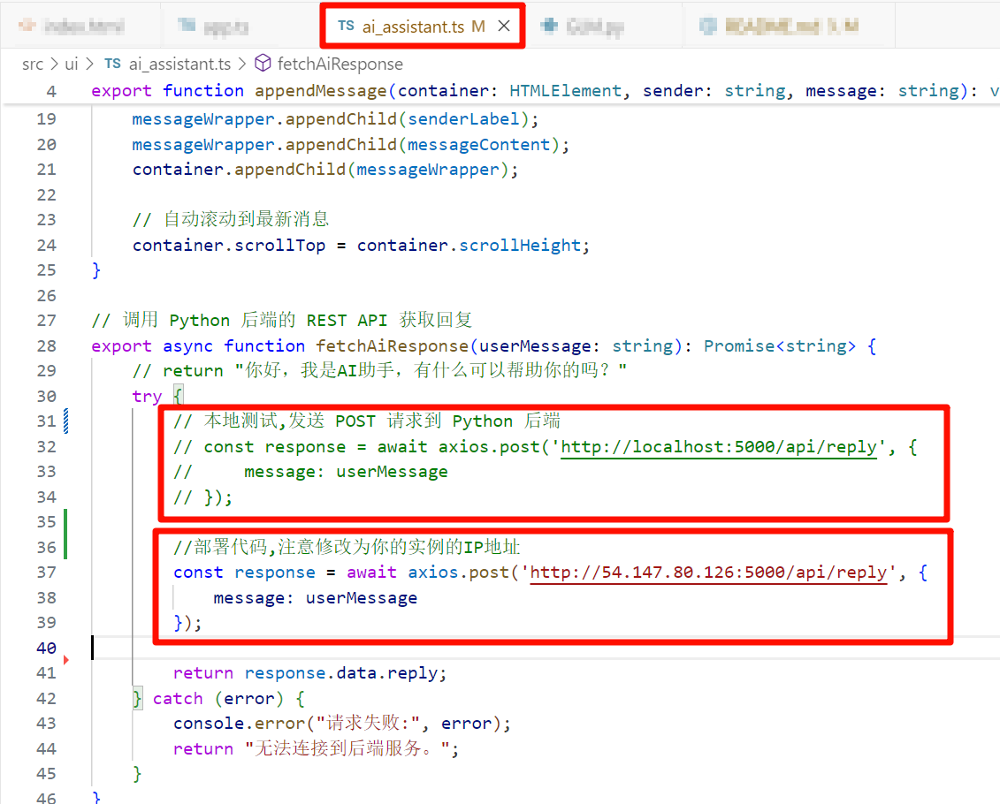

# 基于可视化积木编程的深度学习教学平台

项目改进自开源项目[ENNUI](https://github.com/martinjm97/ENNUI)，它允许用户：

1. 使用拖放界面构建神经网络架构。
2. 循序渐进地学习神经网络搭建方法。
3. 在浏览器中训练这些网络。
4. 可视化训练过程。
5. 导出至Python。

## 项目结构

```
bbvdle/
├── dist/
├── resources/
├── src/
|   ├──ui/              # 前端组件
|   |                    样式、按钮逻辑以及可拖动的组件
|   |                    （例如层和激活函数）    
|   └──model/           # 后端组件
|                        支持构建神经网络、
|                        代码生成以及在浏览器中保存状态的核心功能
└── README.md           # 项目说明文件
```

## Windows部署流程

### 1. 安装Nodejs\python及其他必要包

1. python == 3.8
`pip install Flask flask-cors zhipuai`
2. 下载安装 [node-v13.14.0-x64.msi](https://pan.baidu.com/s/1Cvkd-Bclmcj0SRWhz5nFAg?pwd=okb3 ) 文件，**注意版本必须正确**

### 2. 克隆仓库

`git clone --recursive https://github.com/sunyia123/bbvdle.git`

### 3. 构建应用程序

`npm install`

### 4. 启动项目

`npm run build`

### 5. 部署项目

`npm install -g http-server`
`http-server . -p 8080`
或使用vscode插件`Live Server (Five Server)`

### 6. 部署AI助手后端

切换至bbvdle目录下，执行`python src/model/GLM.py`

代码默认在实例公网ip，本地测试时需要取消src\ui\ai_assistant.ts中“本地测试”部分代码的注释，添加GLM的apikey，去掉src\model\GLM.py `host="0.0.0.0"`部分


## 报错解决

### 1. npm install报错

```报错信息
gyp ERR! find VS 
gyp ERR! find VS msvs_version was set from command line or npm config
gyp ERR! find VS - looking for Visual Studio version 2019
gyp ERR! find VS VCINSTALLDIR not set, not running in VS Command Prompt
gyp ERR! find VS could not use PowerShell to find Visual Studio 2017 or newer
gyp ERR! find VS looking for Visual Studio 2015
gyp ERR! find VS - not found
gyp ERR! find VS not looking for VS2013 as it is only supported up to Node.js 8
gyp ERR! find VS
gyp ERR! find VS valid versions for msvs_version:
gyp ERR! find VS
gyp ERR! find VS **************************************************************
gyp ERR! find VS You need to install the latest version of Visual Studio
gyp ERR! find VS including the "Desktop development with C++" workload.
gyp ERR! find VS For more information consult the documentation at:
gyp ERR! find VS https://github.com/nodejs/node-gyp#on-windows
gyp ERR! find VS **************************************************************
gyp ERR! find VS
gyp ERR! configure error
gyp ERR! stack Error: Could not find any Visual Studio installation to use
```

#### 解决方法

`npm config set proxy false`
`npm cache clean --force`
删除package-lock和node_modules
`npm install canvas@2.8.0 --ignore-scripts`
`npm install`

### 2. npm run build报错

```报错信息
> tsc --skipLibCheck && webpack --mode development && node-sass src/ui -o src/ui

Hash: 4c13200e2cf9321e64bd
Version: webpack 4.41.5
Time: 2618ms
Built at: 2024/10/30 下午12:33:38
           Asset      Size  Chunks             Chunk Names
       bundle.js  8.29 MiB    main  [emitted]  main
data_batch_1.png  22.1 MiB          [emitted]
data_batch_2.png  22.1 MiB          [emitted]
data_batch_3.png  22.1 MiB          [emitted]
data_batch_4.png  22.1 MiB          [emitted]
data_batch_5.png    22 MiB          [emitted]
  test_batch.png  22.1 MiB          [emitted]
Entrypoint main = bundle.js
[./built/model/build_network.js] 4.7 KiB {main} [built]
[./built/model/code_generation.js] 2.02 KiB {main} [built]
[./built/model/data.js] 11.2 KiB {main} [built]
[./built/model/export_model.js] 8.93 KiB {main} [built]
[./built/model/graphs.js] 10 KiB {main} [built]
[./built/model/mnist_model.js] 5.57 KiB {main} [built]
[./built/model/params_object.js] 2.7 KiB {main} [built]
[./built/model/save_state_url.js] 2 KiB {main} [built]
[./built/ui/app.js] 17.5 KiB {main} [built]
[./built/ui/error.js] 487 bytes {main} [built]
[./built/ui/model_templates.js] 8.77 KiB {main} [built]
[./built/ui/shapes/activation.js] 4.63 KiB {main} [built]
[./built/ui/shapes/activationlayer.js] 3.61 KiB {main} [built]
[./built/ui/shapes/layer.js] 11.3 KiB {main} [built]
[./built/ui/shapes/layers/add.js] 1.6 KiB {main} [built]
    + 1916 hidden modules
internal/fs/utils.js:230
    throw err;
    ^
```

#### 解决方法

先尝试
`npm rebuild node-sass`
若不行，则删除 `node-sass` 和其缓存
`npm uninstall node-sass`
`npm cache clean --force`
`npm install node-sass@4.14.1`

## Linux部署流程

### 1. 安装Nodejs

项目部署在AWS EC2上，使用系统为Amazon Linux 2 AMI。

```cmd
sudo yum update -y
sudo yum install git -y
//// 安装Nodejs
curl -fsSL https://fnm.vercel.app/install | bash
source ~/.bashrc
fnm use --install-if-missing 13
```

### 2. 安装配置Python 3.8

```cmd
wget https://mirrors.tuna.tsinghua.edu.cn/anaconda/miniconda/Miniconda3-py38_23.10.0-1-Linux-x86_64.sh
bash Miniconda3-py38_23.10.0-1-Linux-x86_64.sh
source ~/.bashrc
//出现conda23.10.0,安装成功
conda create -n py38 python=3.8
conda activate py38
pip install Flask flask-cors zhipuai
```

### 3. 安装配置Apache并部署项目

1. 安装Apache
`sudo yum install -y httpd`

2. 复制文件至根目录
`sudo cp -r /home/ec2-user/bbvdle/* /var/www/html/`
`cd /var/www/html/`

3. 配置Apache
`sudo systemctl reload httpd`

4. 启动Apache
`sudo systemctl start httpd`

5. 设置开机自启
`sudo systemctl enable httpd`

直接访问公网ip不要加https

### 4. 部署AI助手后端

切换至bbvdle目录下，执行
`python /home/ec2-user/bbvdle/src/model/GLM.py` 
**注意部署前需要修改src\ui\ai_assistant.ts中对应代码为对应实例公网ip，添加api，添加安全组入组规则（接受5000端口）**